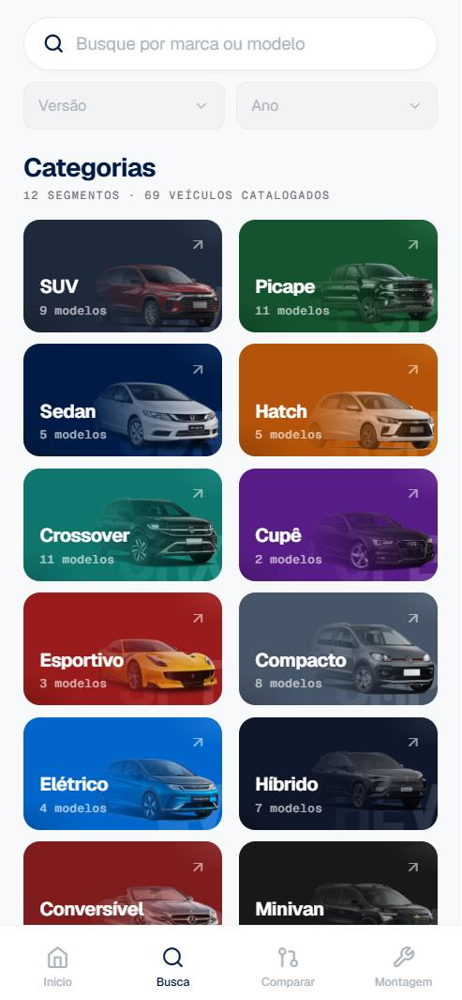
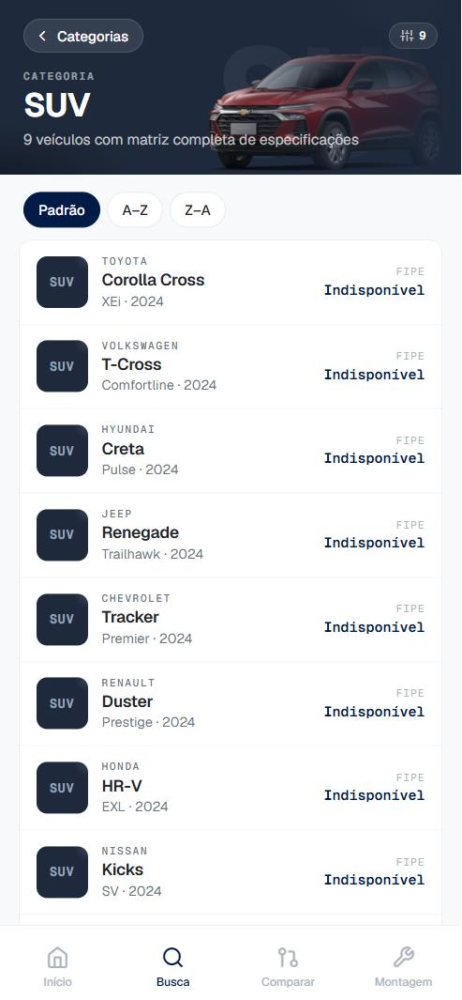
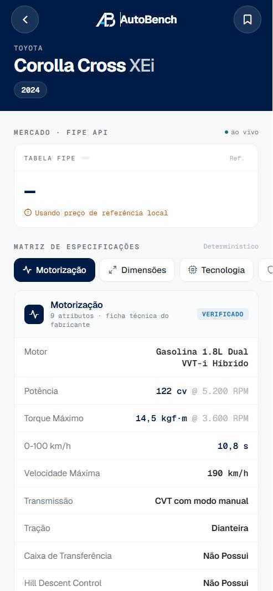
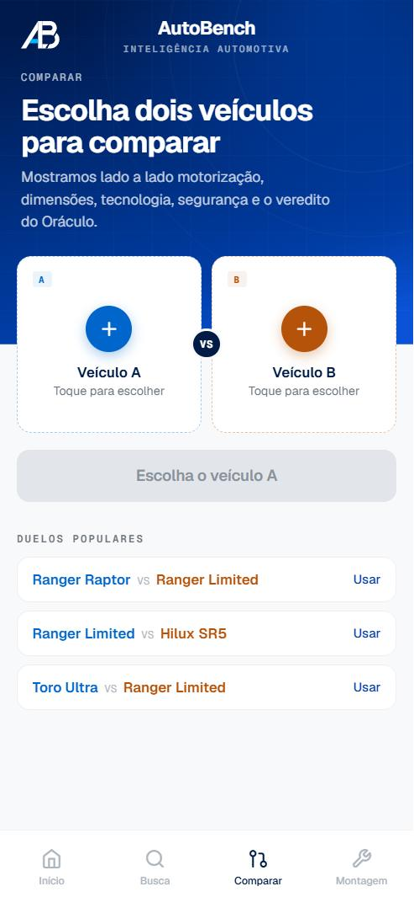
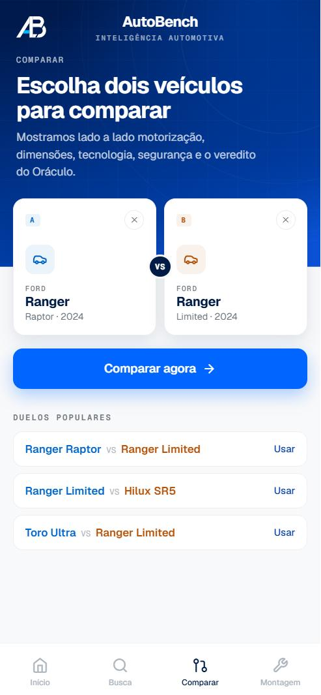
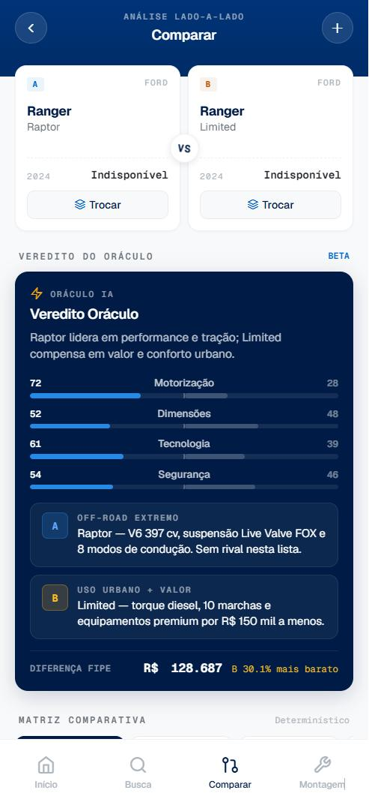
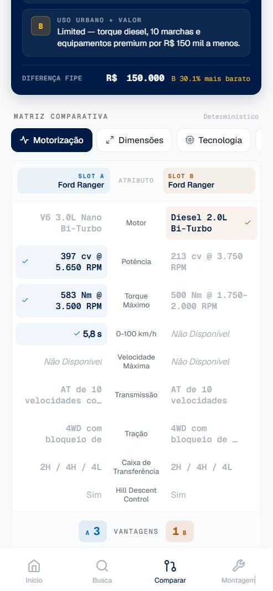
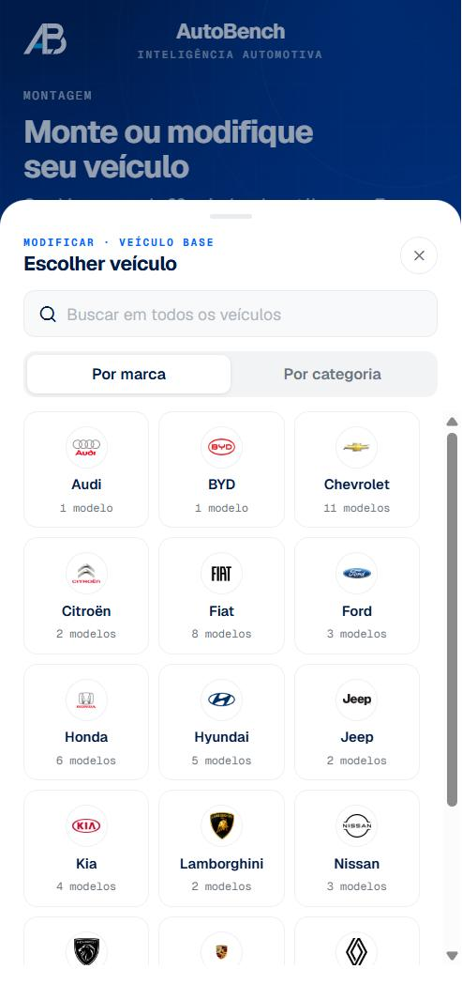
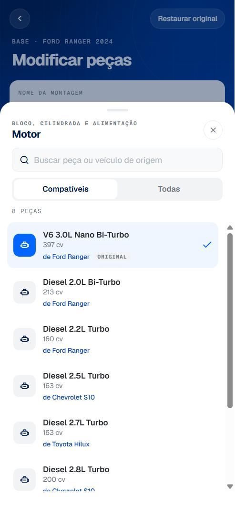

# AutoBench — Ford Challenge

> Ferramenta de inteligência competitiva no mercado automotivo brasileiro.


---

## O Desafio

O mercado automotivo exige que montadoras compreendam rapidamente como seus concorrentes se posicionam em preço e pacotes de equipamentos. Dados imprecisos ou desorganizados custam tempo e decisões estratégicas.

O desafio proposto pela Ford foi:

> *Desenvolver uma ferramenta/modelo/solução que permita receber dados técnicos da concorrência a partir de uma entrada simples e gerar uma lista padronizada de especificações.*

---

## A Solução

O **AutoBench** é um aplicativo mobile multiplataforma (Android e iOS) construído com React Native + Expo. Ele centraliza dados técnicos de veículos concorrentes em um banco local curado e os enriquece com preços de mercado em tempo real via **API FIPE**, permitindo análise e comparação detalhada a partir de uma busca hierárquica simples (marca → modelo → versão → ano).

O app tem dois grandes diferenciais:

- **Oráculo** — um mecanismo de veredito que pontua dois veículos lado a lado em quatro eixos (motorização, dimensões, tecnologia e segurança) e emite uma recomendação estruturada com análise de gap de preço.
- **Montagem** — um configurador que permite modificar um veículo existente ou montar um do zero, trocando peças entre sistemas (motor, câmbio, tração, suspensão, freios, rodas e interior) livremente entre marcas diferentes do catálogo.

---

## Capturas de Tela

### Início

Busca hierárquica por marca/modelo, atalhos por necessidade (Família, Urbano, Trabalho, Econômico), alertas preditivos do Oráculo e navegação por categoria — tudo na tela inicial.


### Busca por Categoria

Navegação pelos 12 segmentos de mercado (SUV, Picape, Sedan, Hatch, Crossover, Cupê, Esportivo, Compacto, Elétrico, Híbrido, Conversível e Minivan), cada um com contagem de modelos catalogados.

<p>
  
  
</p>

### Ficha Técnica

Especificações completas por veículo, organizadas em abas (Motorização, Dimensões, Tecnologia, Segurança), com cotação FIPE em tempo real quando disponível.



### Comparar — Duelo e Veredito do Oráculo

Escolha dois veículos (ou use um duelo popular pré-configurado), veja o veredito gerado pelo Oráculo com pontuação por categoria e análise de gap de preço, e explore a matriz comparativa item a item.

<p>
  
  
</p>
<p>
  
  
</p>

### Montagem — Configurador de Veículos

Modifique um veículo existente trocando peças por outras compatíveis do catálogo (inclusive de outras marcas), ou monte um veículo do zero escolhendo a plataforma e definindo cada sistema. As montagens ficam salvas para continuar depois.

<p>
  
  
</p>
<p>
  
  
</p>

---

## Funcionalidades

### Busca Hierárquica
- Campo de pesquisa inteligente com autocomplete
- Filtros em cascata: marca → modelo → versão → ano
- Categorização em 12 segmentos de mercado (SUV, Picape, Sedan, Hatch, Crossover, Cupê, Esportivo, Compacto, Elétrico, Híbrido, Conversível e Minivan)
- Atalhos por necessidade (Família, Urbano, Trabalho, Econômico) e navegação por marca

### Ficha Técnica Completa
Cada veículo expõe especificações padronizadas organizadas em seções:

| Seção | Dados |
|---|---|
| Motorização | Motor, potência, torque, combustível |
| Transmissão | Câmbio, tração, modos de condução |
| Suspensão & Freios | Tipo de suspensão, freios ABS/EBD |
| Iluminação | Faróis, lanternas, DRL |
| Rodas & Pneus | Aro, dimensões |
| Tecnologia | Central multimídia, Apple CarPlay / Android Auto, câmera 360° |
| Segurança ADAS | Frenagem emergencial, cruise adaptativo, monitoramento de ponto cego |
| Dimensões | Comprimento, porta-malas, peso |
| Precificação | Preço de tabela + cotação FIPE em tempo real |

### Comparação de Veículos
- Seleção de dois veículos (Slot A vs. Slot B) ou duelos populares pré-configurados
- Matriz comparativa com destaque do vencedor por item
- Quatro abas de análise: Motorização · Dimensões · Tecnologia · Segurança

### Oráculo (Veredito Inteligente)
- Pontuação por categoria (0–100) para cada veículo
- Recomendação textual gerada para o par comparado
- Análise de gap de preço (valor absoluto e percentual)
- Vereditos curados para combinações relevantes de mercado (ex.: Ford Ranger Raptor vs. Limited)

### Montagem (Configurador de Veículos)
- **Modificar um veículo**: parte de um modelo existente do catálogo e troca peças individuais
- **Criar do zero**: escolhe a plataforma (monobloco ou chassi sobre longarinas) e define cada sistema
- Troca de peças entre 7 sistemas (Motor, Transmissão, Tração, Suspensão, Freios, Rodas e pneus, Interior), combinando peças de qualquer veículo do catálogo — inclusive de outras marcas
- Indicador de progresso, peças trocadas/adaptadas e origem de cada peça
- Montagens salvas localmente para retomar a edição depois

### Histórico e Favoritos
- Últimas 20 fichas acessadas com timestamp
- Marcação de favoritos com feedback tátil (haptics)
- Dados persistidos localmente via AsyncStorage

---

## Stack Técnica

| Camada | Tecnologia |
|---|---|
| Mobile | React Native 0.85 + Expo 56 |
| Linguagem | TypeScript 6 |
| Roteamento | Expo Router (file-based) |
| Estilização | NativeWind 4 (Tailwind para RN) |
| Estado global | Zustand 5 + AsyncStorage |
| Animações | React Native Reanimated 4 |
| HTTP | Axios + API FIPE (parallelum.com.br) |
| Testes | Jest 29 + Testing Library |

---

## Download

O AutoBench é distribuído como um APK standalone (Android), gerado via **EAS Build**.

➡️ **[Baixar o APK mais recente](https://github.com/Luiz0770/challenge-ford-grupo-AutoBench/releases/latest)** na página de Releases do repositório.

Como o APK não vem da Play Store, o Android pode pedir para habilitar a instalação de "fontes desconhecidas" — basta confirmar para prosseguir.

---

## Estrutura do Projeto

```
app/
├── (tabs)/
│   ├── index.tsx              # Início — busca + favoritos + histórico
│   ├── busca.tsx               # Navegação por categorias
│   ├── comparar/
│   │   ├── index.tsx           # Seleção dos veículos A vs. B
│   │   └── resultado.tsx       # Veredito do Oráculo + matriz comparativa
│   └── montagem/
│       ├── index.tsx           # Início do configurador + montagens salvas
│       └── editar.tsx          # Editor de peças por sistema
├── vehicle/[id].tsx            # Ficha técnica do veículo
├── category-results.tsx        # Lista de veículos por categoria
├── brand-results.tsx           # Lista de veículos por marca
└── model-results.tsx           # Lista de versões filtradas

components/
├── build/                      # UI do módulo Montagem
├── compare/                    # UI do módulo Comparar
├── home/, search/, vehicle/    # UI das demais telas
└── ui/                         # Componentes de interface compartilhados

services/
├── catalog.ts                  # Busca, filtros e lógica de comparação
├── build.ts                    # Lógica do configurador (Montagem)
├── fipe.ts                     # Integração com a API FIPE
└── vehicleData.ts               # Consultas ao banco local de veículos

store/
├── userStore.ts                # Favoritos, histórico e preferências
└── buildStore.ts               # Montagens salvas e rascunho em edição

data/
├── vehicles/                   # Base de especificações técnicas, por categoria
└── categories.json             # Definição dos 12 segmentos
```

---

## Integrantes

| Nome | RM |
|---|---|
| Luiz Felipe Coelho Ramos | 555074 |
| Vitor Musolino Teixeira | 555012 |
| Fernando Gonzales Alexandre | 555045 |
| Lucas Catroppa Piratininga Dias | 555450 |
| Gabriel Guerreiro Escobosa Vallejo | 554973 |
